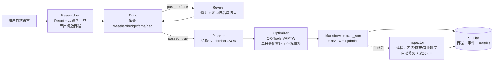

# 行者 · 智能旅游助手

> 一个会真正动手排行程的旅游助手 Agent —— 不是只会聊天的问答机器人。

输入一句话，它自己查天气、搜景点、算交通、排顺序、审预算、防闭馆，最后给出一份可执行的、带地图坐标的、分小时级的行程。

**项目状态**：M1–M6 已完成，M7 交付中 ｜ **最后更新**：2026-09-14 ｜ **仓库**：https://github.com/ppy33/xingzhe

---

## 一句话定位

**「从上海去成都玩 3 天，两个人，预算 3000，喜欢美食人文」** → 自动产出：
结构化的分日行程 + 地图标记 + 审查报告 + 路线优化前后对比 + 行程体检提示。

---

## 多 Agent 架构



五个 Agent 各司其职：**Researcher** 调研 → **Critic** 审查 ↔ **Reviser** 修订（闭环）→ **Planner** 结构化 → **Optimizer** 运筹优化；生成后还可经 **Inspector** 主动体检。

---

## 四个核心亮点

### 1. Critic ⇄ Reviser 审查闭环（M3）
行程生成后由 Critic 结构化审查（天气/预算/时间/地理四维），有问题就退回 Reviser 修订，最多 2 轮。修订引入的新地点经**白名单核验**——不允许模型编造未经工具核实的地点。

### 2. OR-Tools 路线优化（M4）
单日行程抽象成**带时间窗最短路（TSPTW）**：营业时间做时间窗、停留时长做服务时间，GUIDED_LOCAL_SEARCH 限时求解。顺带修掉一个致命 bug——**LLM 会编造坐标**（实测锦里被写到河北），坐标体检以高德工具轨迹的真实坐标覆盖。

### 3. 主动感知体检（M5）
行程生成后主动巡检**闭馆规则 / 雨天户外 / 营业时间越界**三类问题，可自动修复（雨天换室内、闭馆日调整），变更带审计标记，前端高亮。

### 4. 可观测埋点（M6）
每次请求记录**总耗时 / 工具调用数 / token 用量 / 各环节耗时**，前端「观测」面板实时可查；配套 `scenarios/*.yaml` + `run_eval.py` 场景回归套件，产出量化评估报告。

---

## 量化指标（真实请求实测）

| 能力 | 指标 | 实测值 |
|---|---|---|
| 路线优化 | 单日总耗时降幅 | **14.1%**（1h23m→1h14m，12.2→10.9 km）；乱序输入最高 **35.1%** |
| 坐标体检 | LLM 编造坐标修正 | 7 个点里 6 个直接取回高德真实坐标（零额外接口开销） |
| 行程体检 | 雨天户外项识别 | 模拟暴雨抓出 3 个雨天户外 issue → 自动换室内（带审计标记） |
| 端到端 | 单次请求耗时 / 工具数 | ~109s / 15 工具（含 Critic 审查 + 优化求解） |
| 结构化 | 行程 JSON 产出率 | 100%（Planner 三重试加固后不再偶发缺失） |

> 完整评估报告见 `v2/docs/eval_report.md`（`run_eval.py` 一键生成）。

---

## 技术栈

| 层 | 选型 |
|---|---|
| 后端 | Python · FastAPI · LangGraph（多 Agent 编排） |
| 前端 | Vue 3 + Vite（四栏：地图 / 对话 / 行程 / Agent 轨迹） |
| 地图 | 高德 JS API 2.0（前端）+ 高德 Web 服务（POI/天气/路线，后端） |
| 优化 | Google OR-Tools（VRPTW） |
| LLM | DeepSeek（function calling + 结构化输出） |
| 存储 | SQLite（行程 + 事件 + 埋点，WAL 模式，零依赖） |

---

## 快速开始

```bash
# 1. 后端
cd v2/backend
pip install -r requirements.txt
cp .env.example .env        # 填 DEEPSEEK_API_KEY + AMAP_SERVER_KEY
python -m uvicorn main:app --host 127.0.0.1 --port 8000

# 2. 前端（另开终端）
cd v2/frontend
cp .env.example .env.local  # 填 VITE_AMAP_JSAPI_KEY + VITE_AMAP_SECURITY_CODE
npm install && npm run dev  # http://127.0.0.1:5173

# 3. 离线演示（不需要任何密钥，看 UI）
# 浏览器打开 http://127.0.0.1:5173/?demo=1
```

详细步骤（含密钥获取、踩坑速查）见 [`CONTRIBUTING.md`](CONTRIBUTING.md)。

---

## 目录结构

```
行者_智能旅游助手/
├── 行者.html                # v1 单文件原型（只读参考）
├── v2/
│   ├── backend/
│   │   ├── main.py          # FastAPI 入口 + 多 Agent 编排
│   │   ├── agents/          # researcher/critic/reviser/planner/optimizer/inspector
│   │   ├── tools/amap.py    # 高德 7 工具（限流/重试/异常护栏）
│   │   ├── storage.py       # SQLite 存储（行程/事件/埋点）
│   │   ├── scenarios/       # 场景回归套件
│   │   ├── run_eval.py      # 一键跑分脚本
│   │   └── test_*.py        # 离线回归（优化器/体检器/白名单）
│   └── frontend/src/
│       ├── components/      # MapView / PlanPanel / AgentTrace / MetricsPanel ...
│       └── composables/     # useAmap 地图封装
├── 接口契约.md              # 前后端契约（REST/SSE/Schema）
├── 开发计划.md              # 里程碑进度
└── CONTRIBUTING.md          # 开发规范 + 踩坑速查
```

---

## 文档入口

| 文件 | 用途 |
|---|---|
| [`CONTRIBUTING.md`](CONTRIBUTING.md) | 5 分钟跑起来 · 提交规范 · 自检清单 · 密钥纪律 |
| [`接口契约.md`](接口契约.md) | 前后端契约（v1.3，REST / SSE / Schema） |
| [`开发计划.md`](开发计划.md) | 里程碑进度 + 验收标准 + 卡点 |
| [`V2_ROADMAP.md`](V2_ROADMAP.md) | v2 升级路线与差异化定位 |

---

## 里程碑

| 里程碑 | 状态 | 一句话 |
|---|---|---|
| M1 骨架 | ✅ | FastAPI + LangGraph 单 Agent + 7 个高德工具 |
| M2 前端 | ✅ | Vue3 四栏 + `?demo=1` 演示模式 |
| M3 多 Agent | ✅ | Critic ⇄ Reviser 审查闭环 + 结构化行程 |
| M4 运筹优化 | ✅ | OR-Tools VRPTW 排序 + 坐标体检 |
| M5 主动感知 | ✅ | 行程体检 + 自动修复 + SQLite 持久化 |
| M6 观测评估 | ✅ | 埋点面板 + 场景回归套件 |
| M7 交付 | 🔄 | 架构图 + 量化指标 + 演示视频 |
